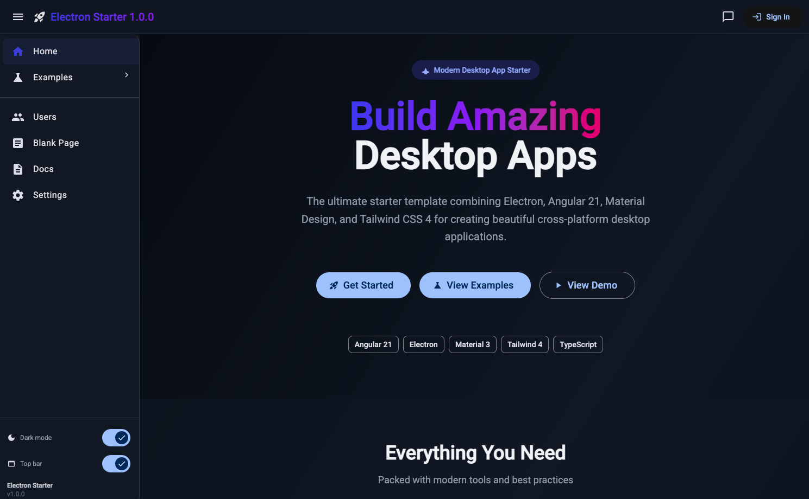

# Electron Angular Starter

A modern desktop application starter template combining Electron, Angular 21, Material Design, and Tailwind CSS 4.

## Features

- ⚡ **Angular 21** - Latest Angular with standalone components and signals
- 🎨 **Material Design 3** - Beautiful Material UI components
- 🌈 **Tailwind CSS 4** - Utility-first CSS framework
- 🖥️ **Electron** - Cross-platform desktop app
- 📱 **Responsive Layout** - Sidenav shell with top nav and footer; sidenav collapses on small screens
- 🔒 **TypeScript** - Type-safe code with strict mode
- 🎯 **Modern Tooling** - Hot reload, fast builds, OnPush change detection
- 🌙 **Dark / Light Mode** - Sidenav slide-toggle; theme persisted in `localStorage`; applies to Material and Tailwind classes
- 🔲 **Top Bar Toggle** - Show/hide the top navigation bar from the sidenav; state persisted in `localStorage`; floating FAB menu button shown when top bar is hidden
- 🧩 **Component Examples** - Dedicated pages for Material and Tailwind showcase
- 🧭 **Breadcrumb Navigation** - Auto-generated breadcrumbs on all non-home pages
- 💬 **Chat Panel** - Right-side drawer with AI chat UI, accessible from the top nav
- 👥 **Users Page** - Fetches 100 users from randomuser.me with card/table toggle, search, pagination, and detail modal with blur backdrop
- 📄 **Blank Page Template** - Ready-to-use page scaffold for new features
## Getting Started

### Installation

```bash
# Install dependencies
npm install
```

## Development

### Web Development Mode

To start a local development server, run:

```bash
npm start
```

Once the server is running, open your browser and navigate to `http://localhost:4200/`.

### Electron Development Mode

Run the app as an Electron desktop application:

```bash
# Terminal 1: Start Angular dev server
npm start

# Terminal 2: Start Electron (in a separate terminal)
npm run electron:dev
```

## Building for Production

### Build Web App Only

```bash
npm run build
```

Output will be in `dist/angular/browser/`

### Build Desktop Apps

Build for your current platform:

```bash
npm run electron:build
```

Build for specific platforms:

```bash
# macOS (DMG and ZIP)
npm run electron:build-mac

# Windows (NSIS installer and portable)
npm run electron:build-win

# Linux (AppImage and DEB)
npm run electron:build-linux
```

Built applications will be in the `release/` directory.

## Project Structure

```
electron-angular/
├── src/
│   ├── app/
│   │   ├── configs/          # App-wide configuration (appName, version, apiBaseUrl)
│   │   ├── layout/           # Shell layout (top nav, sidenav, chat drawer, footer)
│   │   ├── home/             # Landing page (sidenav hidden by default)
│   │   ├── blank/            # Blank page template for new features
│   │   ├── users/            # Users page (card/table view, search, pagination, detail modal)
│   │   │   └── user-detail-dialog/  # User detail dialog component
│   │   ├── examples/         # Component examples overview
│   │   │   ├── material/     # Material Design examples page
│   │   │   └── tailwind/     # Tailwind CSS examples page
│   │   ├── login/            # Login page (outside layout)
│   │   ├── signup/           # Signup page (outside layout)
│   │   └── services/         # Shared services (UserService, ThemeService)
│   ├── styles.scss           # Global styles
│   └── index.html            # Main HTML
├── public/
│   └── assets/
│       └── images/           # Application icons
├── electron-main.js          # Electron main process
├── preload.js                # Electron preload script
├── CHANGELOG.md              # Version history
└── package.json              # Dependencies and scripts
```

> Current build: `subVersion 2026.02.20-1`

## Routes

| Path | Component | Layout |
|---|---|---|
| `/` | Home | ✅ Layout (sidenav hidden) |
| `/users` | Users | ✅ Layout |
| `/examples` | Examples (overview) | ✅ Layout |
| `/examples/material` | Material Examples | ✅ Layout |
| `/examples/tailwind` | Tailwind Examples | ✅ Layout |
| `/blank` | Blank Page Template | ✅ Layout |
| `/login` | Login | ❌ No layout |
| `/signup` | Signup | ❌ No layout |

## Available Scripts

- `npm start` - Start Angular dev server
- `npm run build` - Build Angular app for production
- `npm test` - Run tests
- `npm run electron` - Run Electron (requires built Angular app)
- `npm run electron:dev` - Run Electron in development mode
- `npm run electron:build` - Build desktop app for current platform
- `npm run electron:build-mac` - Build for macOS
- `npm run electron:build-win` - Build for Windows
- `npm run electron:build-linux` - Build for Linux

## Technologies

- [Angular 21](https://angular.dev) - Web framework
- [Electron](https://www.electronjs.org/) - Desktop framework
- [Material Design](https://material.angular.io/) - UI components
- [Tailwind CSS](https://tailwindcss.com/) - CSS framework
- [TypeScript](https://www.typescriptlang.org/) - Programming language

## Building Icons

The application icon is located at **`public/assets/images/logo1.png`**

Electron Builder automatically converts this PNG file to the appropriate format for each platform (ICNS for macOS, ICO for Windows, PNG for Linux).

### Icon Requirements:
- **Minimum size**: 512x512 pixels
- **Recommended size**: 1024x1024 pixels  
- **Format**: PNG with transparency
- **Aspect ratio**: Square (1:1)

To use a different icon, simply replace `public/assets/images/logo1.png` with your new icon file and rebuild.

## Code Scaffolding

Angular CLI includes powerful code scaffolding tools. To generate a new component, run:

```bash
ng generate component component-name
```

## Running Tests

To execute unit tests with Vitest:

```bash
npm test
```

## Screenshot
Home screen


## Additional Resources

- [Angular CLI Documentation](https://angular.dev/tools/cli)
- [Electron Documentation](https://www.electronjs.org/docs/latest)
- [Material Design Guidelines](https://m3.material.io/)
- [Tailwind CSS Documentation](https://tailwindcss.com/docs)

## Credits

This project was built with the assistance of [GitHub Copilot](https://github.com/features/copilot), an AI pair programmer that helped accelerate development and improve code quality.

## License

This project is licensed under the MIT License - see the [LICENSE](LICENSE) file for details.

## Changelog

See [CHANGELOG.md](CHANGELOG.md) for a detailed list of changes.
